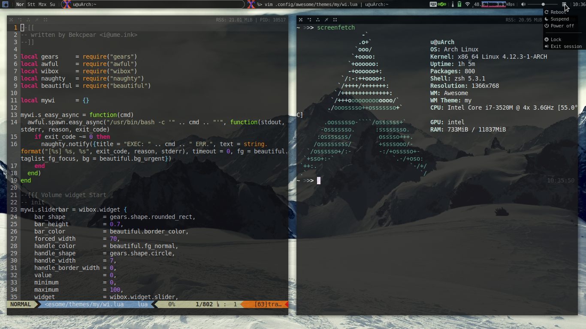
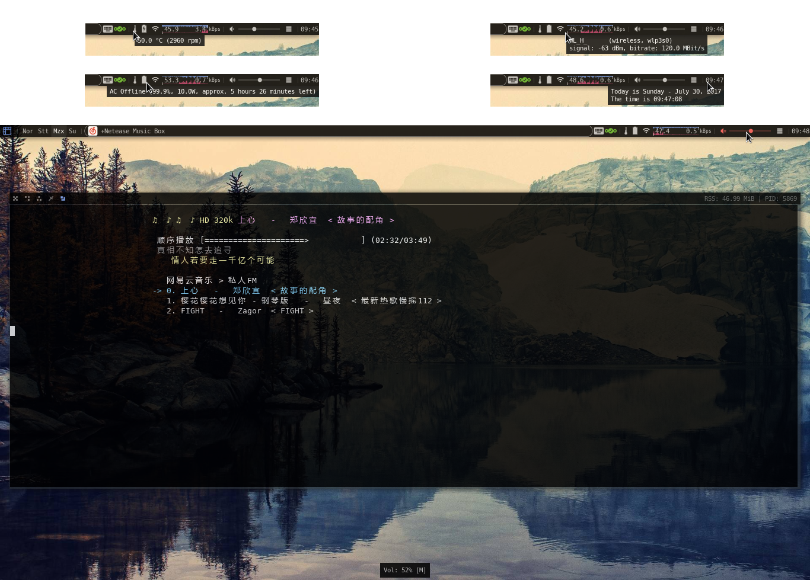
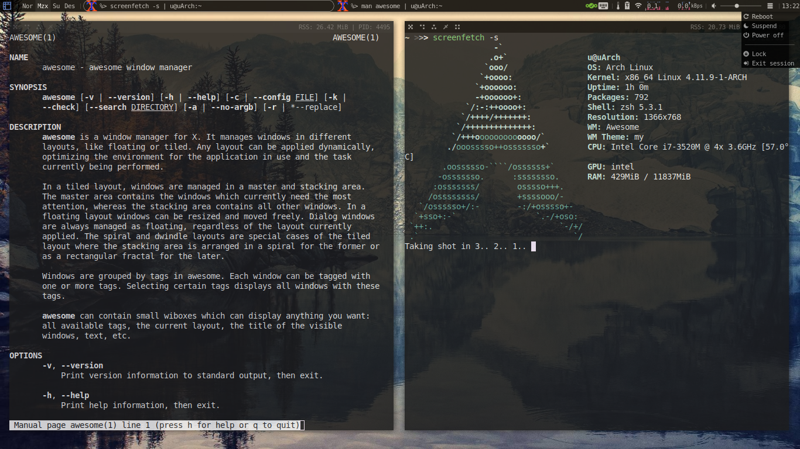

## X230 + Archlinux + AwesomeWM 配置文件

我的配置和主题文件，目的是避免以后万一系统需要重装麻烦

* 60G SSD 单 BtrFS 格式分区 + LUKS 全盘加密
* 自写 AwesomeWM 4.1 主题（网络显示依赖 NetworkManager, 声音调节依赖 pulseaudio 且不支持蓝牙），截图在最后

  * 自写功能：

    * 音量滑动调节 + 显示
    * 调节亮度时显示
    * 有线/无线联网状态显示 + 信号/速率显示 + 实时图
    * 剩余电量/使用时间/充电状态显示
    * CPU 温度/风扇转速显示
    * Mod4 + W （或右上角按钮）显示关机/重启/睡眠等操作按钮
    * PrtSc 键利用 `gnome-screenshot` 捕获整个屏幕区域保存图像到家目录下
    * 使用 i3lock 锁屏，利用 xautolock 定时锁屏（接电源时）/睡眠（仅电池时）。 *但有一个问题是其无法判断当前是否正在播放视频，如果看视频的时候那就直接* `xautolock -disable` *来临时禁用就好*
    * 自动随机切换壁纸，可以单独设定日/夜壁纸目录
    * 存在 PID 的窗口显示其 PID 以及其 Resident Set Size

  * 注：文件 `/usr/share/awesome/lib/awful/widget/button.lua` 下有一个修改

  ```diff
  @@ -40,7 +40,7 @@
           img_release = surface.load(image)
             img_press = img_release:create_similar(cairo.Content.COLOR_ALPHA, img_release.width, img_release.height)
                      local cr = cairo.Context(img_press)
  ---        cr:set_source_surface(img_release, 2, 2)
  +++        cr:set_source_surface(img_release, 0, 0.5)
             cr:paint()
                      orig_set_image(self, img_release)
         end
  ```

* 无 display manager, tty 下通过 shell 判断是否 startx
* 利用 systemd 服务实现睡眠前如果未锁屏则自动锁屏后睡眠
* Xterm 作为主 terminal, 透明已经在 awesome 下配置，<s>需要启动 xcompmgr 以实现</s> 替换成了 compton 以实现窗口阴影/过渡，几个部件透明等效果
* zsh 作为默认 shell
* tlp 来管理电源（需要 mask 掉 systemd-rfkill.service 和 systemd-rfkill.socket）
* fcitx 下自定义了一个未激活时的 icon，默认可以 `cp _mis/fcitx_inactive.png /usr/share/fcitx/skin/classic/inactive.png`
* musicbox 利用 Sakura 运行并自定义了图标， `cp _mic/netease-cloud-music.svg /usr/share/pixmaps/` ，自定义了颜色，直接修改 `ui.py` 大约 68 行：

```
            #info
            curses.init_pair(1, 231, curses.COLOR_BLACK)
            #hover
            curses.init_pair(2, 117, curses.COLOR_BLACK)
            #LRC
            curses.init_pair(3, 229, curses.COLOR_BLACK)
            #title
            curses.init_pair(4, 219, curses.COLOR_BLACK)
```

也可能有配置遗漏...







